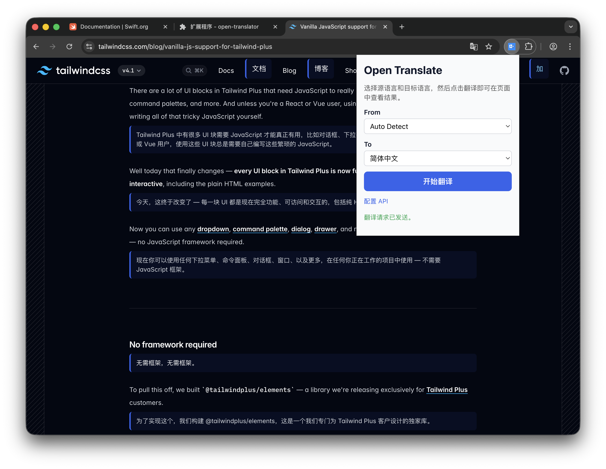

# 纯净式翻译（Open Translate）
> 面向 Chrome 的 AI 网页全文翻译扩展，接入任意兼容 OpenAI 的模型，在原页面内直接展示译文。

  

纯净式翻译（Open Translate）专注一件事：把网页上可读的段落交给你信任的模型处理，再把结果以原生风格插回去。没有冗余的侧边栏，也不绑定任何云服务——只要能兼容 OpenAI Chat Completions，就能工作。

  

## 目录
- [为什么选择纯净式翻译](#为什么选择纯净式翻译)
- [核心亮点](#核心亮点)
- [架构速览](#架构速览)
- [快速开始](#快速开始)
- [配置你的 AI 服务](#配置你的-ai-服务)
- [翻译一整页](#翻译一整页)
- [开发者备忘](#开发者备忘)
- [路线图](#路线图)
- [如何贡献](#如何贡献)
- [许可协议](#许可协议)

## 为什么选择纯净式翻译
- **原生体验**：只包含弹窗、Options 页面和页面内嵌提示，延续原有阅读流。
- **带上你自己的模型**：OpenAI、Azure、DeepSeek、Ollama、LM Studio……只要有 Chat Completions 接口即可。
- **逻辑透明**：TypeScript + React + WXT 架构，模块划分清晰，方便二次开发。

## 核心亮点
- 🧠 **真正的全文翻译**：扫描标题、段落、引用、列表等元素，避免嵌套重复，翻译块直接显示在原段落后方。
- ⚙️ **无厂商锁定**：Options 页面可配置 Base URL / API Key / Model，默认指向本地 `http://localhost:11434` + `gemma3:1b`。
- 🖥 **一键触发**：弹窗中选择源语言/目标语言（支持自动检测），点击“开始翻译”即可。
- 🛡 **稳健反馈**：分批请求、占位提示、Toast 通知、错误高亮，清楚知道当前进度。
- 🔐 **隐私友好**：所有配置保存在 `browser.storage.local`，数据只会发送给你设置的服务端。
- 🧩 **易于扩展**：content/background/popup/options 各自独立，公共逻辑沉淀在 `src/` 下，方便加入提示模板、快捷键、脚本等特性。

## 架构速览
```
popup(App.tsx) ──▶ content script ──▶ background worker ──▶ 你的大语言模型
       ▲               │                    │
       │               │                    └── src/translator.ts 构造 Chat Completions 请求
       │               └── src/storage.ts 维护语言对和接口配置
options(App.tsx) ◀─────┘                    └── declarativeNetRequest 同步自定义 Origin 头
```

- `entrypoints/popup/`：React 弹窗，语言切换、CTA、状态提示。
- `entrypoints/content.ts`：段落收集、占位块渲染、Toast 显示。
- `entrypoints/background.ts`：处理 `translate-paragraphs` 消息、读取配置、调用 `requestTranslation`。
- `entrypoints/options/`：配置 Base URL / API Key / Model 的设置页。
- `src/translator.ts`：拼装 Prompt、调用 `/v1/chat/completions`、解析模型返回。
- `src/languages.ts`：维护可选语言列表，可按需拓展。

## 快速开始

### 环境要求
- Bun ≥ 1.1（推荐，仓库默认使用 Bun 并提供 `bun.lock`）
- Node.js ≥ 18（可选，如果你仍希望使用 npm / pnpm）
- Chrome（Manifest V3）
- 任意兼容 OpenAI Chat Completions 的接口

### 安装依赖
```bash
git clone https://github.com/<your-account>/open-translate.git
cd open-translate
bun install      # 首选 Bun；若无法使用，可改用 npm install / pnpm install
```

### 本地开发
```bash
bun run dev              # Chrome MV3（默认）
```

1. 命令会启动 WXT，并输出至 `.output/chromium-mv3/dev`。
2. 在 Chrome 打开 `chrome://extensions`。
3. 打开开发者模式，点击 “Load unpacked”，选择生成的 Dev 目录。
4. 保持 dev server 运行，即可享受热重载。

### 生产构建
```bash
bun run build            # 产物位于 .output/chromium-mv3/prod
bun run zip              # 生成可直接上传商店的压缩包
```

## 配置你的 AI 服务
1. 点击扩展图标 → `配置 API`，或访问 `chrome://extensions/?options=<扩展ID>`。
2. 填写以下字段：
   - **Base URL**：如 `https://api.openai.com`、`https://api.deepseek.com`、`http://localhost:11434`。
   - **API Key**：仅保存在本地 `browser.storage.local`。
   - **Model**：任意 Chat Completions 模型名（如 `gpt-4o-mini`、`deepseek-chat`、`gemma3:1b`）。
3. 保存后，后台脚本会自动更新 declarativeNetRequest 规则，使请求携带正确的 `Origin`。
4. 开发模式下可在 `.env` 中写入 `VITE_OT_BASE_URL` / `VITE_OT_API_KEY` / `VITE_OT_MODEL` 预填默认值；也可直接调整 `src/storage.ts` 中的 `DEFAULT_SETTINGS`。

> 💡 所有配置仅存在你的浏览器本地。删除扩展或清空存储即可彻底移除。

## 翻译一整页
1. 打开任意包含可读内容的网页。
2. 点击 纯净式翻译（Open Translate）图标。
3. 选择源语言（支持自动检测）与目标语言。
4. 点击“开始翻译”，content script 会：
   - 收集可见段落并去重；
   - 以 5 条为一组发送至后台与模型；
   - 在原段后插入“翻译中…”占位；
   - 收到结果后替换成最终译文。

右上角 Toast 会实时提示成功或失败，便于快速判断状态。

## 开发者备忘
- `bun run compile`：仅做类型检查，不产出文件。
- 想扩充语言选项？修改 `src/languages.ts` 中的 `LANGUAGE_OPTIONS`。
- 想定制提示词/分块策略？查看 `src/translator.ts` 与 `entrypoints/content.ts`。
- 公共工具函数请放在 `src/`，方便 popup 与脚本共享。

## 路线图
当前阶段聚焦「AI 全文翻译体验」一件事，优先事项包括：

- 根据语言对优化 Prompt，减少格式化错误。
- 自适应分块与重试策略，兼容慢速或限流接口。
- 扩展默认语言列表，覆盖更多场景。
-（可选）加入匿名性能指标，辅助定位瓶颈。

欢迎通过 Issues 讨论新想法，但会优先考虑提升翻译质量与稳定性的需求。

## 如何贡献
1. Fork 仓库并创建特性分支。
2. 运行 `bun run dev`，并通过 `bun run compile` 确认类型无误。
3. 提交 PR 时请清楚说明动机、方案，并附上截图或 GIF（若涉及 UI）。
4. 提交 Issue 时请附带浏览器版本、复现步骤、console 日志等信息。

有疑问？直接提 Issue，维护者会尽快回复。

## 许可协议
项目采用 [GNU General Public License v3.0](LICENSE)，欢迎在相同许可下贡献代码。
